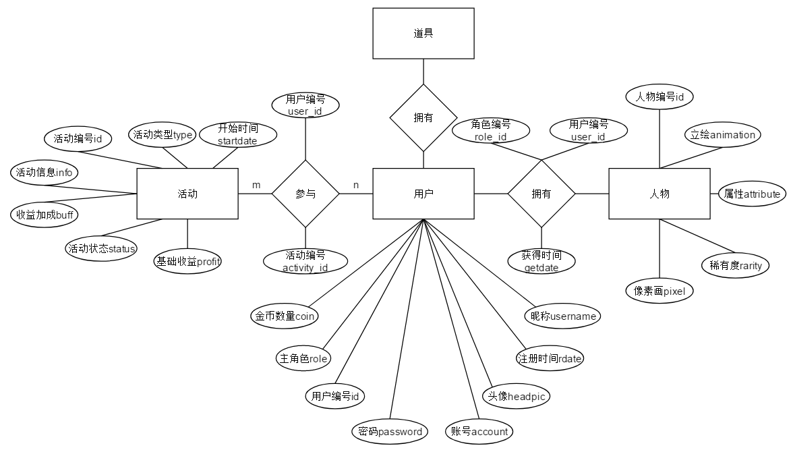

# TimePower
This is an intersting time management software

## 需求分析
### 用户行为分析

1. 开始活动

    选择活动类型(闹钟、签到、时间管理、跑步等)
2. 创建队伍
3. 活动开始前设置活动内容
4. 分享队伍链接
5. 加入队伍
6. 结束活动
7. 金币获取
8. 查看金币数
9. 购买道具（抽取次数）
10. 抽取人物
11. 按时间段查看历史活动记录 
 
    历史活动记录包括：活动的开始时间，结束时间，活动类型，参与者
12. 查看人物背包
13. 查看人物信息
14. 查看道具背包#
15. 查看个人信息（昵称、主人物、头像……）
16. 修改个人信息（昵称、主人物、头像……）
17. 查看软件设置
18. 修改软件设置
19. 登陆/注销/注册账号

### 功能分析（需求的具体实现）
1. 在“活动创建界面”设置开始按钮，点击开始按钮后活动按活动流程执行不同的操作。向服务器发送请求“创建活动”功能

    活动流程：
    + 计时器活动：需要在“活动创建界面”设置好倒计时（设置方式：顺时针拖动计时轮盘的触点至想要的时长，数字计时会实时显示）并于屏幕上显示出来（范围10min~120min），点击开始按钮后，数字计时开始倒数，且计时轮盘能随着数字计时的变化旋转，开始按钮变成暂停按钮，暂停按钮在点击开始按钮后10s内可被点击，10s后变为结束按钮。

        计时器活动开始后，若检测到手机进入娱乐性软件则发出提醒，若进入娱乐性软件的停留时间超过10s则视为计时器活动失败；若倒计时至0则视为活动完成并发放奖励（金币+*）。
2. 前端提供创建队伍的复选框，若以队伍模式开始活动则界面变化为“等待配对界面”并提供队伍链接（链接形式：二维码或url），并开始等待倒计时（120s），若在等待倒计时结束前配对完成则进入“活动开始界面”；否则返回“活动创建界面”。
3. 于“活动创建界面”依据活动流程设置活动的参数
4. 进入“等待配对界面”后弹出队伍的二维码及url并提供分享到常用社交软件（QQ，tim，微信等）的按钮，url提供一键复制功能。
5. “活动创建界面”提供加入队伍按钮，可选择二维码加入或链接加入，二维码加入功能需实现提取本地相册或直接扫码，url加入功能需提供输入url的文本框，或实现读取剪贴板的内容加入队伍。
6. 活动开始10s后，开始按钮变为结束按钮，点击后回到“活动创建界面”并记录数据。
7. 用户活动完成后，服务器依据活动的基础收益以及加成计算实际收益，并写入该用户的数据库金币信息中。（游客无法获得金币）
8. “活动创建界面”增加显示用户金币数量的区域，通过读取服务器信息显示该用户的金币数量
9. “活动创建界面”增加商店按钮，点击后跳转到“商店界面”。“商店界面”增加“购买抽卡次数”按钮，点击后先本地检查金币数量，若足够则再向服务器发起请求（防本地修改），服务器检查玩家的金币数量，若能购买则修改相应数据，并返回购买成功的状态，若不能购买则返回购买失败状态，前端获取状态信息并显示结果。
10. “商店界面”增加“抽取人物”按钮，点击后先本地检查抽卡次数，若抽卡次数足够则向服务器发送请求核对信息，若抽卡次数足够则服务器调用“人物抽取功能”并返回人物信息，否则返回失败状态。前端依据服务器返回的状态显示相应结果。
11. 在“活动创建界面”左上角添加菜单按钮，点击后左侧显示“菜单”。“菜单”添加“历史记录”一栏，点击进入“历史记录界面”向服务器发出查询请求，服务器调用“查询功能”返回该用户所有活动信息。获取信息后，本地可按天、周、月、年查询历史活动记录，记录信息包括活动类型，起始时间，是否完成，实际收益，若以组队形式参加则同时显示组队人员。
12. #“活动创建界面”添加“背包”按钮，点击弹出“背包界面”，向服务器发送背包查询请求，服务器调用“用户道具查询”与“用户人物查询”功能返回该用户背包信息。“背包界面”需分成“人物”与“道具”两个选项卡，选中“人物”选项卡则改变UI并显示人物的缩略图，选中“道具”同理。点击缩略图后出现暗框显示“人物”或“道具”的信息，再次单击暗框消失。
13. 同上
14. 同上上
15. “菜单”顶部添加“头像按钮”显示个人头像，登陆用户可点击头像按钮进行修改。增加“个人信息”栏，点击后显示“个人信息界面”（需从服务器获取信息或读取本地存储？），个人信息界面显示用户名，头像等信息，并提供修改按钮。
16. “个人信息界面”点击想修改的信息旁的修改按钮进行修改。
17. “菜单”底部增加“设置”按钮，点击后跳转至“设置界面”，读取本地数据显示设置信息。
18. 用户可在“设置界面”修改设置信息
19. “设置界面”底部添加注销按钮，点击后跳转至“登陆界面”。未登陆用户点击“菜单”顶部的头像按钮可跳转至“登陆界面”，登陆界面添加账号密码的输入框以及登陆、注册按钮，点击注册按钮跳转至注册界面。左上角添加返回按钮跳转至“活动创建界面”，此时处于未登录状态使用软件，无法获得金币。

## 前端
### 创建活动界面

#### 功能按钮
1. 菜单按钮
    
    点击后展开左侧菜单栏
2. 开始按钮
3. 组队复选框
4. 商店按钮
#### 显示
1. 用户金币数量
#### 附加组件
1. 菜单栏
2. 活动选择区

    ~~显示在屏幕中间，可通过左右滑动选择不同的活动，并设置活动的参数~~

    计时器活动：
    * 功能按钮：计时轮盘触点，通过旋转改变活动时长
    * 显示：数字计时显示，显示计时轮盘实际对应时间

    ~~其他活动：。。。~~

### 等待配对界面
### 活动开始界面
### 商店界面
### 历史记录界面
### 背包界面
### 个人信息界面
### 设置界面
### 登陆界面

## 后端
### 数据库设计

### 服务器接口
#### 请求检验、返回数据
    
    筛选客户端的合法请求并分发给后端，像客户端返回后端处理的结果。需要检验数据的合法性
#### 添加用户-addUser 
+ 接口编号：1
+ 参数：新用户的账号-newAcnt，新用户的密码-newPwd
+ 功能：判断用户账号是否存在，若存在返回失败信息，若不存在则将用户的账号密码、注册时间...写入user表，若成功则返回成功状态
+ 返回值：创建状态-statu
  + 账号已存在：-1
  + 账号创建成功：1
  + 账号创建失败：0

#### 创建活动-crtAct
+ 接口编号：2
+ 参数：用户账号列表-userAcnts，活动类型-actType，活动信息-actInfo，开始时间-startT
+ 功能：创建活动信息，写入activity表，同时根据用户列表创建U-A表项
+ 返回值：无
  
#### 获得角色—getRole
+ 接口编号：3
+ 参数：用户id-uid，获得角色id-rid
+ 功能：将uid与rid写入user-role表
+ 返回值：状态码statu
  + 成功返回True
  + 失败返回False
#### 修改密码-changePwd
+ 接口编号：4
+ 参数：用户账号-userAcnt，原密码-oldPwd，新密码-newPwd
+ 功能：修改用户密码
+ 返回值：状态码statu
  + 修改成功：0
  + 失败，原密码错误：1
  + 失败，账号不存在：2
  + 失败，存在多个账号：3
#### 修改昵称-changeNickname
+ 接口编号：5
+ 参数：用户账号-userAcnt，新头像-newName
+ 功能：修改用户昵称
+ 返回值：状态码statu
  + 修改成功：0
  + 失败，账号不存在：2
  + 失败，存在多个账号：3
#### 修改主角色-changeRole
+ 接口编号：6
+ 参数:用户账号-userAcnt，角色编号-rid
+ 功能：修改用户的主角色，检验该角色是否拥有
+ 返回值:状态码statu
  + 修改成功True
  + 修改失败False
#### 修改头像-changeHpic
+ 接口编号：7
+ 参数：用户账号-userAcnt，新头像-newHpic
+ 功能：修改用户头像
+ 返回值：状态码statu
  + 修改成功：0
  + 失败，账号不存在：2
  + 失败，存在多个账号：3

#### 活动结算-actStatus
+ 接口编号：8
+ 参数：活动id-aid，状态码-statuCode
+ 功能：接受状态码（-1-未完成 1-完成）修改activity表中aid对应活动的状态.若活动成功完成则发放金币
+ 返回值：状态码statu
  + 成功返回结算后获得金币的数量
  + 失败返回-1

#### 查询用户角色-usersRole
+ 接口编号：9
+ 参数：用户id-uid
+ 功能：查找User-Role表，获取用户所拥有的角色的编号
+ 返回值：返回用户拥有的角色编号列表roleList

#### 查询账号信息-getUserInfo
+ 接口编号：10
+ 参数：用户账号userAcnt
+ 功能：返回对应账户的信息（昵称、头像、金币数量、主角色）
+ 返回值：包含账户信息的字典，内容包括昵称-username,头像-headpic，金币数量-coin，主角色-role

#### 活动状态查询-getActStatu
+ 接口编号：11
+ 参数：活动id-aid
+ 功能：查询指定id活动的进行状态
+ 返回值：状态码statu
  + 进行中返回0
  + 失败返回-1
  + 成功返回1

### 次级接口
#### 账号存在性检_ifAcntExist
+ 参数：用户账号_userAcnt
+ 功能：检验用户账号是否存在
+ 返回值：若不存在返回0，若仅存在一个账号则返回匹配账号对象，若存在多个账号则返回匹配账号的数量

#### 修改金币数量（增/减）_changeCoin
+ 参数：用户id_userid，操作码_code(0-减少，1增加)，数量_num
+ 功能：修改用户金币数
+ 返回值：False修改失败，True修改成功

#### 计算初始收益_calprofit
+ 参数：活动类型_actType，活动信息_actInfo
+ 功能：根据活动类型与信息，计算初始收益profit
+ 返回值：计算的结果，整型

#### 创建用户-活动表项_crtU_A
+ 参数：用户id_uid，活动id_aid，活动开始时间_startT
+ 功能：activity_user表项创建，初始创建时活动状态为0代表进行中，1代表成功，2代表失败
+ 返回值：无

#### 根据用户账号查询用户id_acnt_to_id
+ 参数：用户账号acnt
+ 功能：根据用户账号查询用户id
+ 返回值：若存在返回用户id，否则返回-1

[*_*]:可拓展的功能：宠物系统，开宠物卡池，宠物每天可有一定几率带回道具；增加道具：恶魔的挑战书（使用后24h内，完成一次两小时以上自习可获得额外道具）